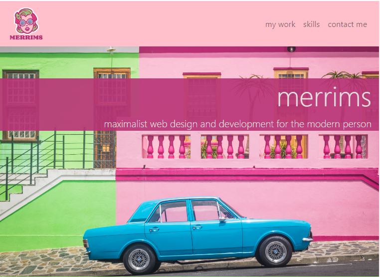
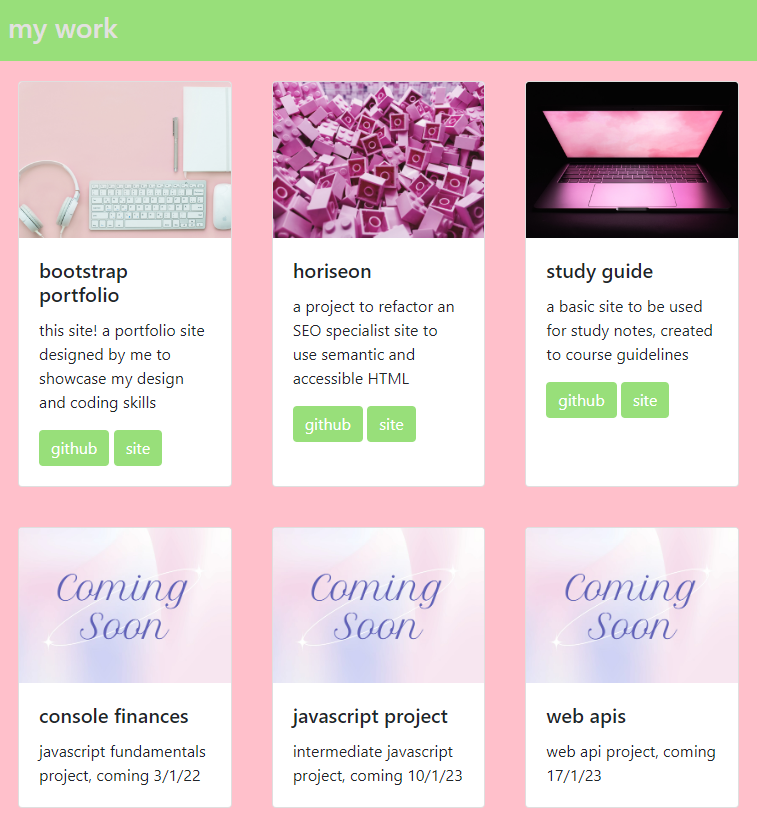
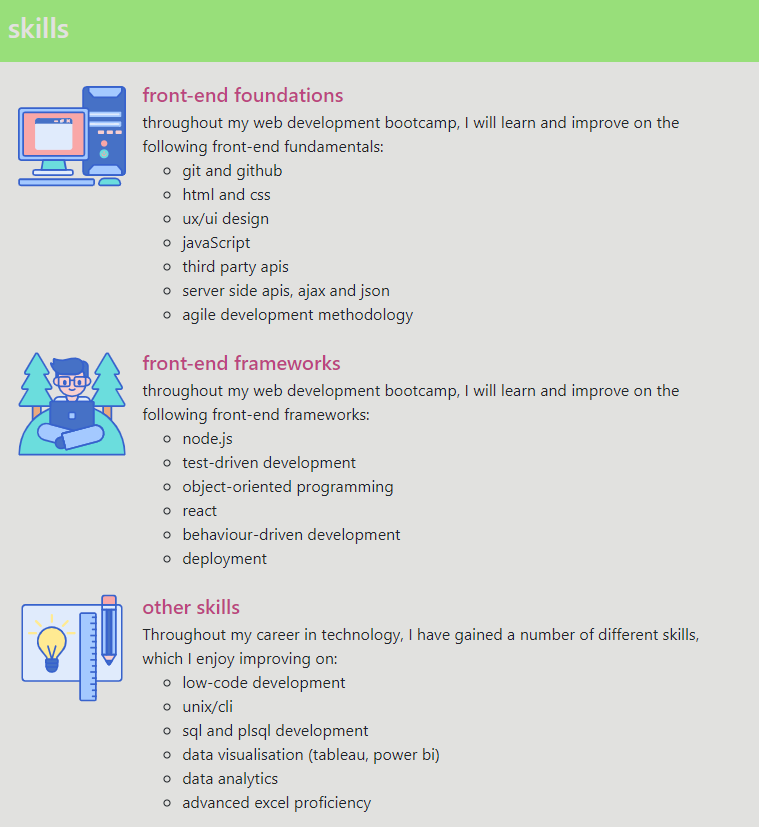
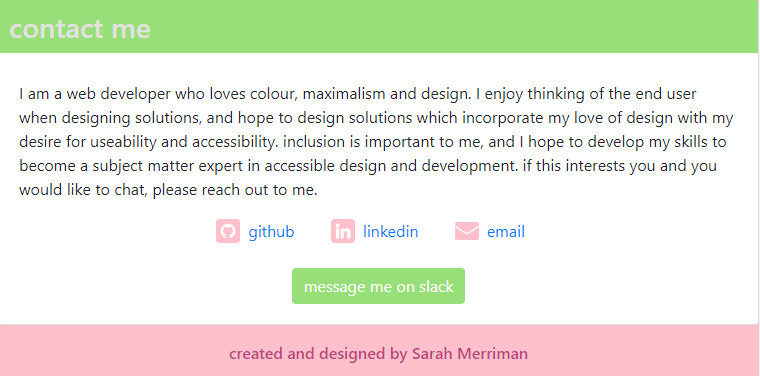

# Bootstrap Portfolio

## Description

This website is a portfolio of my work created by editing bootstrap components for my front end skills bootcamp. I wanted to create a site that showcases my work, but also my design style, and enjoyed using online libraries for icons and images to capture my personality in the website.

I learned a lot about customising CSS to make it your own during this project and solidified my understanding of key HTML concepts such as parent divs and flexbox.

## Usage

The site displays a navigation bar with a jumbotron introducing myself and the portfolio:

When you select 'my work' from the navigation bar, or scroll, you will see a section which depicts the work I have done already as part of bootcamp alongside some placeholder cards for upcoming work. You can select the links in each card to visit the github page or deployment of each project:

When you select 'skills' from the navigation bar, or continue to scroll, you will see a section with icons which states skills to be learned during the bootcamp as well as other relevant professional skills:

When you select 'contact me' from the navigation bar, or continue to scroll, you will see a section with a short 'about me' paragraph with hyperlinks which can be selected to visit my github, linkedin profile or open an email to my email address. Below this is a button which will take you to a direct message with me on Slack. Beneath this is a basic footer:

## Credits

I used Bootstrap extensively for components for the page: https://getbootstrap.com/docs/4.3/components

I also used StackExchange on many occasions for ideas when debugging specific issues: https://stackoverflow.com/

I used some code from MaxDesign to style my contact list: https://css.maxdesign.com.au/listutorial/master.htm

I referred to W3Schools for clarification on some concepts: https://www.w3schools.com/css/default.asp and https://www.w3schools.com/html/default.asp

For the jumbotron and project photos, I used Unsplash: https://unsplash.com/

I designed my logo and the 'coming soon' image on VistaCreate: https://create.vista.com/

I used a premium account on FlatIcon for the skills section icons and the customised social media icons: https://flaticon.com/

## License

MIT Licence